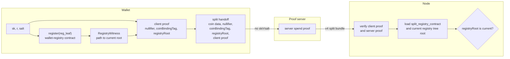

# Split-Prove

Split-Prove is a proof-of-concept for Midnight zswap delegated proving. It lets a wallet outsource the expensive spend proof to a proof server without sending the raw zswap secret key (`sk`) to that server.

The wallet keeps the private identity material and proves the `sk`-dependent part locally. The proof server proves the heavier spend relation from handoff data. The node is still the source of truth: it verifies both proofs and admits a split spend only when the submitted registry root is the current root of the configured wallet-registry contract.

## How It Works



The v4 split bundle keeps the public wire shape focused on:

- `spend_proof`
- `client_derivation_proof`
- `coin_binding_tag`
- `registry_root`

The client proof shows that the wallet derived the canonical zswap nullifier and coin-binding tag from its private material, and that its registration leaf is in the registry tree rooted at `registry_root`. The server proof shows the spend itself is valid. The node then checks `registry_root` against `LedgerParameters.split_registry_contract`; if that contract is missing, unconfigured, malformed, or at a different current root, the split spend is rejected.

The proof server is intentionally non-authoritative. It can verify the client transcript before doing work, but ledger admission decides whether a root is live.

## Local Demo

One-time setup:

```bash
npm install
make local-install
cp .env.example .env
make rebuild-images
```

Start the rebuilt local stack in another terminal:

```bash
make local-nodes
```

Run the split-send e2e:

```bash
make e2e
```

Use local-dev option 6 to fund the split-prove wallet before running the e2e. The demo scans for the funded shielded output, builds the client proof, asks `/v2/prove-split-spend` for the server proof, assembles the transaction, balances Dust, submits it to the rebuilt local node, and waits for inclusion.

The full registry-anchoring loop now runs end-to-end. The `wallet_registry` contract is deployed at genesis (`GenesisGenerator::deploy_wallet_registry`), the wallet submits `register(reg_leaf)` once per seed via `make register-wallet`, and every subsequent split spend reads the live contract state to build its Merkle path. Admission enforces `registryRoot == current_split_registry_root(state)` — the legacy `MIDNIGHT_SPLIT_REGISTRY_DEV_ACCEPT_ALL=1` bypass is no longer set by `make native-node` / `make native-indexer` and the supported path is real-root validation. The bypass code remains in the ledger as a diagnostic switch.

Negative control:

```bash
MIDNIGHT_LOCAL_FORCE_CORRUPT_REGISTRY_WITNESS=1 make e2e
```

forces the wallet to build a structurally-mismatched witness; admission rejects with `MalformedTransaction::SplitRegistryRootNotCurrent` (wire code `Custom(139)`).

## Repo Layout

- [circuits/](circuits/) contains the Compact circuits for wallet registration/attestation and client derivation.
- [src/](src/) contains the local client helpers, including registry witness refresh from serialized contract state.
- [deps/midnight-ledger](deps/midnight-ledger) contains the patched zswap verifier, ledger admission checks, and proof-server endpoint.
- [deps/midnight-node](deps/midnight-node) and [deps/midnight-indexer](deps/midnight-indexer) are rebuilt against the patched ledger.
- [deps/midnight-local-dev](deps/midnight-local-dev) runs the local stack and includes the split-prove funding option.
- [tools/](tools/) contains wallet SDK bridge helpers for seed derivation, Dust balancing, and raw-RPC submission.

## Notes

This PoC requires the patched ledger, node, and indexer. Stock hosted nodes do not know how to decode or verify the split proof bundle.

The current privacy boundary is narrow and explicit: the proof server should not receive `sk`, registration blinding, registration salt, or the registry path secret inputs. On-chain split public inputs are limited to the shared split transcript fields, and normal double-spend semantics are preserved through the canonical zswap nullifier.

## POC Caveats

These are operational simplifications, not soundness issues. None of them block correctness on the local-node e2e; each would be revisited if this ships beyond a POC.

- **Deterministic `(r, salt)` from `sk`.** The wallet derives its registration blinding pair as `transientHash(domain_sep, sk_limbs)` rather than HKDF-from-a-master-seed. Property required by the PoC: same wallet seed → same `reg_leaf` across the `register-wallet` run and every subsequent split spend, with no on-disk wallet state. Production wallets would derive `(r, salt)` from a master seed and a wallet identifier and persist them; the soundness chain (`reg_leaf` is bound to `sk` via Poseidon, `r`/`salt` stay private witnesses for every per-spend proof) is unchanged.
- **Fixed registry-contract maintenance authority and deploy nonce.** `GenesisGenerator::deploy_wallet_registry` uses a hard-coded 32-byte nonce (`midnight:split-prove:wallet-reg!`) so the registry's `ContractAddress` is reproducible across `make regen-genesis` runs and can be baked into `ledger-parameters-config.json`. Production governance would parameterise the maintenance authority and use a randomly-chosen deploy nonce captured at genesis time.
- **Single-network preset.** Only the `dev` / `undeployed` presets are wired up. Other network configs (`mainnet`, `preview`, etc.) keep `split_registry_contract: null` and are explicitly out of scope.
- **Wire-code collapse for registry rejections.** Four `MalformedTransaction` variants (`SplitRegistryContractUnconfigured`, `SplitRegistryContractNotPresent`, `MalformedSplitRegistryState`, `SplitRegistryRootNotCurrent`) all collapse into substrate `Custom(139)` because the shared `MalformedTransaction → MalformedError` mapping in [deps/midnight-node/ledger/src/versions/common/conversions.rs](deps/midnight-node/ledger/src/versions/common/conversions.rs) covers both ledger v7 (no split-prove variants) and v8 (with them). The node still logs the actual variant name in its `log::warn!` line. Giving them distinct wire codes needs a cfg-gated split.
- **`min_time_to_dismiss` headroom.** Dev preset bumped from 15 ms to 1 s to give the register-call tx (contract proof + Dust spend proof + 20-deep merkle-insert program) enough budget. Production presets untouched.
- **`MIDNIGHT_SPLIT_REGISTRY_DEV_ACCEPT_ALL=1` bypass code remains in the ledger** as a diagnostic switch (off by default in the local stack). The supported path is real-root validation; the switch exists so that a future operator can opt back in to diagnose admission failures without rebuilding the node.

More detail lives in:

- [docs/poc-runbook.md](docs/poc-runbook.md) for local operation.
- [docs/split-proof-design.md](docs/split-proof-design.md) for proof-boundary details.
- [docs/submodule-changes.md](docs/submodule-changes.md) for vendored dependency changes.
- [docs/spike-results.md](docs/spike-results.md) for proof-cost notes.
