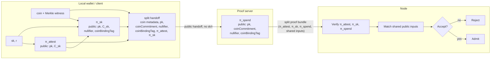

# Split-Prove

Split-Prove is a proof-of-concept for Midnight zswap delegated proving. The goal is to let a wallet outsource the expensive spend proof to a proof server without sending the raw zswap secret key (`sk`) to that server.

The wallet proves only the relations that require `sk`. The proof server proves the coin commitment, Merkle membership, nullifier insertion, value commitment, and spend rules from public handoff data. A patched node verifies all proofs and checks that their shared public inputs match before accepting the transaction.

## How It Works



There are three proofs in the current bundle:

- `π_attest`, generated once at wallet setup, proves the wallet knows `sk`, proves `pk` was derived from that `sk`, and proves `C_sk` commits to the same `sk` using wallet-only randomness `r`.
- `π_sk`, generated for each spend, proves the wallet knows the same `sk` committed in `C_sk`, proves the canonical zswap nullifier was derived from that `sk` and the coin, and proves the coin-binding tag was derived from the coin and `pk`.
- `π_spend`, generated by the proof server, proves the coin commitment was built from the coin and `pk`, proves that commitment is in the Merkle tree, proves the declared nullifier is inserted, and proves the value commitment and spend rules are valid.

At submission time the node verifies all three proofs and checks the shared public values: `pk`, `C_sk`, `nullifier`, `coinBindingTag`, and `coinCommitment`.

The important optimization is that the wallet does not recompute the expensive `pk = H(sk)` relation on every spend. That relation moves to the one-time wallet attestation proof. Per spend, the wallet opens `C_sk` with a cheaper Poseidon/transient-hash commitment and proves the canonical nullifier relation, preserving normal double-spend semantics.

## Running The E2E

The main demo runs a full split-send against the local Midnight stack:

```bash
make e2e
```

One-time setup:

```bash
npm install
make local-install
cp .env.example .env
make rebuild-images
```

Start the local node/indexer/proof-server stack in another terminal:

```bash
make local-nodes
```

Use local-dev option 6 to fund the split-prove wallet before running `make e2e`. The demo scans for the funded shielded output, creates the wallet attestation and per-spend client proof, calls `/v2/prove-split-spend`, assembles the split transaction, Dust-balances it, submits it to the rebuilt node, and waits for inclusion. Both node and indexer must be rebuilt against the patched ledger; the helper defaults to local patched endpoints and refuses remote node/indexer URLs unless `MIDNIGHT_ALLOW_REMOTE_PATCHED_STACK=1` is set for a known patched pair.

The current split-prove demo supports user-owned shielded coins only. Contract-owned split spends are rejected by the proof-server and SDK preimage builder.

More run details, environment variables, and endpoint shapes live in [docs/poc-runbook.md](docs/poc-runbook.md).

## Repo Layout

- [circuits/](circuits/) contains the Compact circuits for wallet attestation and client derivation.
- [deps/midnight-ledger](deps/midnight-ledger) contains the patched ledger, zswap verifier, and proof-server changes.
- [deps/midnight-node](deps/midnight-node) and [deps/midnight-indexer](deps/midnight-indexer) are rebuilt against the patched ledger so split-send blocks are accepted and replayed.
- [deps/midnight-local-dev](deps/midnight-local-dev) runs the local stack and includes the split-prove funding option.
- [tools/](tools/) contains wallet SDK bridge helpers for seed derivation, Dust balancing, and raw-RPC submission.
- [docs/](docs/) contains the detailed runbook, proof design notes, submodule change summary, and proof-cost spike notes.

## Compatibility And Privacy

This PoC requires the patched ledger, node, and indexer. Stock preview nodes do not know how to decode or verify the split proof bundle, wallet attestation proof, or client derivation proof, so they reject split-send blocks.

The PoC is designed to protect the raw `sk` from the proof server, but it is not a final privacy design. The current split envelope exposes stable wallet-linked values, especially `pk` and `C_sk`, so repeated split-prove spends from the same wallet may be linkable. A production direction would wrap or aggregate the attestation, client proof, and server proof so the ledger sees only the normal spend statement.

## More Documentation

- [docs/split-proof-design.md](docs/split-proof-design.md) explains the proof boundary, common engineering questions, and approaches that were tried and discarded.
- [docs/poc-runbook.md](docs/poc-runbook.md) is the operational runbook for the local E2E.
- [docs/submodule-changes.md](docs/submodule-changes.md) summarizes the vendored dependency changes.
- [docs/spike-results.md](docs/spike-results.md) records the proof-cost spike that led to the Poseidon `C_sk` commitment.
