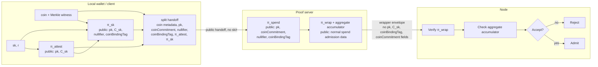

# Split-Prove

Split-Prove is a proof-of-concept for Midnight zswap delegated proving. The goal is to let a wallet outsource the expensive spend proof to a proof server without sending the raw zswap secret key (`sk`) to that server.

The wallet proves only the relations that require `sk`. The proof server proves the coin commitment, Merkle membership, nullifier insertion, value commitment, and spend rules from public handoff data, then wraps the wallet/server proofs in a recursive privacy proof. A patched node verifies the wrapper and its aggregate accumulator before accepting the transaction.

## How It Works



There are three inner proofs and one wrapper proof in the current flow:

- `π_attest`, generated once at wallet setup, proves the wallet knows `sk`, proves `pk` was derived from that `sk`, and proves `C_sk` commits to the same `sk` using wallet-only randomness `r`.
- `π_sk`, generated for each spend, proves the wallet knows the same `sk` committed in `C_sk`, proves the canonical zswap nullifier was derived from that `sk` and the coin, and proves the coin-binding tag was derived from the coin and `pk`.
- `π_spend`, generated by the proof server, proves the coin commitment was built from the coin and `pk`, proves that commitment is in the Merkle tree, proves the declared nullifier is inserted, and proves the value commitment and spend rules are valid.
- `π_wrap`, generated by the proof server after `π_spend`, recursively verifies `π_attest`, `π_sk`, and `π_spend` while keeping their split-only shared values private to the wrapper witness.

At submission time the node verifies only the wrapper proof plus its aggregate accumulator. The wrapper public inputs are the normal spend admission fields: Merkle root, nullifier, value commitment, contract address/none, and segment. The stable split-only linkage values `pk`, `C_sk`, `coinBindingTag`, and `coinCommitment` are not exposed as ledger/public envelope fields.

The important optimization is that the wallet does not recompute the expensive `pk = H(sk)` relation on every spend. That relation moves to the one-time wallet attestation proof. Per spend, the wallet opens `C_sk` with a cheaper Poseidon/transient-hash commitment and proves the canonical nullifier relation, preserving normal double-spend semantics. The latest live e2e shows the resulting asymmetry clearly: the wallet's per-spend client proof took 818 ms, while the remote server recursive proving path took 192,755 ms once the privacy wrapper was included.

The recursive privacy-wrapper branch intentionally changes proof transcript compatibility: inner proofs must be generated with the Poseidon transcript expected by Midnight's recursive `VerifierGadget`. Existing Blake2b-transcript direct split proof bytes are not wrapper-compatible.

## Running The E2E

The main demo runs a full split-send against the local Midnight stack:

```bash
make e2e
```

One-time setup:

```bash
npm install
make local-install
cp .env.example .env
make rebuild-images
```

Start the local node/indexer/proof-server stack in another terminal:

```bash
make local-nodes
```

Use local-dev option 6 to fund the split-prove wallet before running `make e2e`. The demo scans for the funded shielded output, creates the wallet attestation and per-spend client proof, calls `/v2/prove-split-spend`, assembles the split transaction, Dust-balances it, submits it to the rebuilt node, and waits for inclusion. Both node and indexer must be rebuilt against the patched ledger; the helper defaults to local patched endpoints and refuses remote node/indexer URLs unless `MIDNIGHT_ALLOW_REMOTE_PATCHED_STACK=1` is set for a known patched pair.

The current split-prove demo supports user-owned shielded coins only. Contract-owned split spends are rejected by the proof-server and SDK preimage builder.

More run details, environment variables, and endpoint shapes live in [docs/poc-runbook.md](docs/poc-runbook.md).

## Repo Layout

- [circuits/](circuits/) contains the Compact circuits for wallet attestation and client derivation.
- [deps/midnight-ledger](deps/midnight-ledger) contains the patched ledger, zswap verifier, and proof-server changes; this branch uses local branch `recursive-privacy-wrapper-ledger`. The pre-wrapper comparison branch is `direct-split-bundle-ledger`.
- [deps/midnight-node](deps/midnight-node) and [deps/midnight-indexer](deps/midnight-indexer) are rebuilt against the patched ledger so split-send blocks are accepted and replayed. This branch uses local branch `recursive-privacy-wrapper-node`; the pre-wrapper comparison branches are `direct-split-bundle-node` and `direct-split-bundle-indexer`.
- [deps/midnight-local-dev](deps/midnight-local-dev) runs the local stack and includes the split-prove funding option.
- [tools/](tools/) contains wallet SDK bridge helpers for seed derivation, Dust balancing, and raw-RPC submission.
- [docs/](docs/) contains the detailed runbook, proof design notes, submodule change summary, and proof-cost spike notes.

## Compatibility And Privacy

This PoC requires the patched ledger, node, and indexer. Stock preview nodes do not know how to decode or verify the split wrapper envelope, recursive wrapper proof, or aggregate accumulator, so they reject split-send blocks.

The PoC is designed to protect the raw `sk` from the proof server and to stop exposing split-only linkage values to the ledger. The proof server still sees the current handoff metadata (`pk`, `coinCommitment`, `coinBindingTag`, and related coin/Merkle data), so the privacy scope is ledger/public visibility rather than proof-server privacy. The main new tradeoff is compatibility: this branch requires Poseidon-transcript proof generation and regenerated/patched verifier artifacts instead of accepting existing Blake2b-transcript direct split proof material.

## More Documentation

- [docs/split-proof-design.md](docs/split-proof-design.md) explains the proof boundary, common engineering questions, and approaches that were tried and discarded.
- [docs/recursive-privacy-wrapper.md](docs/recursive-privacy-wrapper.md) explains the recursive wrapper, what it hides, what it does not hide, and the current cost/compatibility tradeoffs.
- [docs/poc-runbook.md](docs/poc-runbook.md) is the operational runbook for the local E2E.
- [docs/submodule-changes.md](docs/submodule-changes.md) summarizes the vendored dependency changes.
- [docs/spike-results.md](docs/spike-results.md) records the proof-cost spike that led to the Poseidon `C_sk` commitment.
